# md2visio Mermaid转Visio工具

## 变更记录 (Changelog)

| 日期 | 版本 | 变更内容 | 作者 |
|------|------|----------|------|
| 2025-12-23 | v2.0.0 | 完整架构分析与模块索引文档重构，新增时序图支持 | Claude |

---

## 项目愿景

**md2visio** 是一个将 Mermaid.js 图表语法转换为 Microsoft Visio (.vsdx) 文件的工具，基于 .NET 8 和 C# 开发。系统通过状态机解析 Mermaid 语法，构建抽象语法树(AST)，然后通过 COM Interop 调用 Visio API 生成专业的 Visio 图表文件。

**核心特性**：
- **状态机解析引擎**：基于正则表达式的逐字符状态机解析器，支持多种图表语法
- **TypeMap调度架构**：通过类型映射表实现解析器、构建器、绘制器的松耦合
- **COM对象生命周期管理**：精细控制 Visio 应用程序实例的创建、复用与释放
- **YAML配置系统**：支持样式配置、主题切换、FrontMatter覆盖
- **GUI/CLI双模式**：提供 Windows Forms 图形界面和命令行两种使用方式

---

## 架构总览

### 硬件/运行环境架构
```
    ┌─────────────────────────────────────────────────────────────┐
    │                   .NET 8 Runtime (Windows)                   │
    │  ┌─────────────┐  ┌─────────────┐  ┌─────────────────────┐  │
    │  │   md2visio   │  │ md2visio.GUI │  │  COM Interop Layer  │  │
    │  │   核心库     │  │    WinForms  │  │  Visio Automation   │  │
    │  └─────────────┘  └─────────────┘  └─────────────────────┘  │
    └─────────────────────────────────────────────────────────────┘
                              │
           ┌──────────────────┼──────────────────┐
           │                  │                  │
    ┌─────────────┐    ┌─────────────┐   ┌─────────────┐
    │   输入解析    │    │   数据结构    │   │   输出绘制    │
    │   Mermaid    │    │   AST模型    │   │   Visio COM   │
    │   状态机     │    │   Figure层   │   │   绘制引擎    │
    └─────────────┘    └─────────────┘   └─────────────┘
```

### 软件分层架构

系统采用**三层状态机驱动架构**：

- **解析层 (mermaid/)**：状态机逐字符解析 Mermaid 语法，生成状态序列
- **数据层 (struc/)**：抽象语法树与图表数据模型，构建器模式生成 Figure 对象
- **绘制层 (vsdx/)**：COM Interop 调用 Visio API，将 Figure 对象渲染为 .vsdx 文件

---

## 模块结构图

```mermaid
graph TD
    A["(根) md2visio"] --> B["md2visio<br/>核心库"];
    A --> C["md2visio.GUI<br/>图形界面"];

    B --> D["main/<br/>入口与配置"];
    B --> E["mermaid/<br/>解析引擎"];
    B --> F["struc/<br/>数据结构"];
    B --> G["vsdx/<br/>绘制引擎"];
    B --> H["default/<br/>配置文件"];

    D --> D1["AppConfig.cs<br/>全局配置/CLI入口"];
    D --> D2["AppTest.cs<br/>测试入口"];
    D --> D3["ConsoleApp.cs<br/>控制台入口"];

    E --> E1["@cmn/<br/>通用状态机组件"];
    E --> E2["graph/<br/>流程图解析器"];
    E --> E3["sequence/<br/>时序图解析器"];
    E --> E4["journey/<br/>旅程图解析器"];
    E --> E5["pie/<br/>饼图解析器"];
    E --> E6["packet/<br/>数据包图解析器"];
    E --> E7["xy/<br/>XY图表解析器"];

    E1 --> E1a["SynContext.cs<br/>解析上下文"];
    E1 --> E1b["TypeMap.cs<br/>类型映射表"];
    E1 --> E1c["SynState.cs<br/>状态基类"];
    E1 --> E1d["SttIterator.cs<br/>状态迭代器"];

    F --> F1["figure/<br/>图表基础架构"];
    F --> F2["graph/<br/>流程图数据结构"];
    F --> F3["sequence/<br/>时序图数据结构"];
    F --> F4["journey/<br/>旅程图数据结构"];
    F --> F5["pie/<br/>饼图数据结构"];
    F --> F6["packet/<br/>数据包图数据结构"];
    F --> F7["xy/<br/>XY图数据结构"];

    F1 --> F1a["FigureBuilderFactory.cs<br/>构建器工厂(核心调度)"];
    F1 --> F1b["Figure.cs<br/>图表基类"];
    F1 --> F1c["Config.cs<br/>配置加载器"];

    G --> G1["@base/<br/>绘制基础组件"];
    G --> G2["@tool/<br/>绘制工具"];
    G --> G3["VBuilderG/VDrawerG<br/>流程图绘制"];
    G --> G4["VBuilderSeq/VDrawerSeq<br/>时序图绘制"];
    G --> G5["其他图表绘制器"];

    G1 --> G1a["VBuilder.cs<br/>Visio应用管理"];
    G1 --> G1b["VFigureBuilder.cs<br/>图表构建器基类"];
    G1 --> G1c["VFigureDrawer.cs<br/>图表绘制器基类"];

    H --> H1["flowchart.yaml<br/>流程图配置"];
    H --> H2["sequence.yaml<br/>时序图配置"];
    H --> H3["theme/<br/>主题配置"];

    C --> C1["Forms/<br/>窗体"];
    C --> C2["Services/<br/>服务层"];
    C1 --> C1a["MainForm.cs<br/>主窗体"];
    C2 --> C2a["ConversionService.cs<br/>转换服务"];
```



---

## 模块索引

### 核心模块索引

| 模块路径 | 职责描述 | 关键文件 | 关键类/接口 |
|----------|----------|----------|-------------|
| `md2visio/main/` | **应用入口**：命令行参数解析、全局配置、COM对象生命周期管理 | `AppConfig.cs` | `AppConfig` (单例模式) |
| `md2visio/mermaid/@cmn/` | **解析核心**：状态机基础设施、类型映射、解析上下文 | `SynContext.cs`, `TypeMap.cs`, `SynState.cs` | `SynContext`, `TypeMap`, `SttIterator` |
| `md2visio/struc/figure/` | **数据核心**：图表基类、构建器工厂、配置系统 | `FigureBuilderFactory.cs`, `Figure.cs`, `Config.cs` | `FigureBuilderFactory`, `Figure`, `FigureBuilder` |
| `md2visio/vsdx/@base/` | **绘制核心**：Visio应用管理、绘制器基类 | `VBuilder.cs`, `VFigureBuilder.cs`, `VFigureDrawer.cs` | `VBuilder`, `VFigureBuilder<T>`, `VFigureDrawer<T>` |
| `md2visio.GUI/Services/` | **GUI服务层**：异步转换服务、事件通知、COM对象管理 | `ConversionService.cs` | `ConversionService`, `ConversionResult` |

### 解析器模块索引 (mermaid/)

| 图表类型 | 模块路径 | 关键文件 | 状态类 |
|----------|----------|----------|--------|
| 流程图 | `mermaid/graph/` | `GSttKeyword.cs`, `GSttText.cs`, `GSttLinkStart.cs` | `GSttKeyword`, `GSttChar`, `GSttText`, `GSttLinkStart`, `GSttLinkEnd` |
| 时序图 | `mermaid/sequence/` | `SeqSttKeyword.cs`, `SeqSttMessage.cs`, `SeqSttParticipantId.cs` | `SeqSttKeyword`, `SeqSttChar`, `SeqSttMessage`, `SeqSttParticipantDecl` |
| 旅程图 | `mermaid/journey/` | `JoSttKeyword.cs`, `JoSttTriple.cs` | `JoSttKeyword`, `JoSttChar`, `JoSttTriple`, `JoSttWord` |
| 饼图 | `mermaid/pie/` | `PieSttKeyword.cs`, `PieSttTuple.cs` | `PieSttKeyword`, `PieSttChar`, `PieSttTuple` |
| 数据包图 | `mermaid/packet/` | `PacSttKeyword.cs`, `PacSttTuple.cs` | `PacSttKeyword`, `PaSttChar`, `PacSttTuple` |
| XY图表 | `mermaid/xy/` | `XySttKeyword.cs`, `XySttWord.cs` | `XySttKeyword`, `XySttChar`, `XySttWord` |

### 数据结构模块索引 (struc/)

| 图表类型 | 模块路径 | 关键文件 | 数据类 |
|----------|----------|----------|--------|
| 流程图 | `struc/graph/` | `Graph.cs`, `GBuilder.cs`, `GNode.cs`, `GEdge.cs` | `Graph`, `GBuilder`, `GNode`, `GEdge`, `GSubgraph`, `GNodeShape` |
| 时序图 | `struc/sequence/` | `Sequence.cs`, `SeqBuilder.cs`, `SeqMessage.cs` | `Sequence`, `SeqBuilder`, `SeqParticipant`, `SeqMessage`, `SeqActivation` |
| 旅程图 | `struc/journey/` | `Journey.cs`, `JoBuilder.cs`, `JoSection.cs` | `Journey`, `JoBuilder`, `JoSection`, `JoTask` |
| 饼图 | `struc/pie/` | `Pie.cs`, `PieBuilder.cs`, `PieDataItem.cs` | `Pie`, `PieBuilder`, `PieDataItem` |
| 数据包图 | `struc/packet/` | `Packet.cs`, `PacBuilder.cs`, `PacBlock.cs` | `Packet`, `PacBuilder`, `PacBlock` |
| XY图表 | `struc/xy/` | `XyChart.cs`, `XyBuilder.cs`, `XyAxis.cs` | `XyChart`, `XyBuilder`, `XyAxis` |

### 绘制器模块索引 (vsdx/)

| 图表类型 | 构建器文件 | 绘制器文件 | 关键类 |
|----------|------------|------------|--------|
| 流程图 | `VBuilderG.cs` | `VDrawerG.cs` | `VBuilderG`, `VDrawerG` |
| 时序图 | `VBuilderSeq.cs` | `VDrawerSeq.cs` | `VBuilderSeq`, `VDrawerSeq` |
| 旅程图 | `VBuilderJo.cs` | `VDrawerJo.cs` | `VBuilderJo`, `VDrawerJo` |
| 饼图 | `VBuilderPie.cs` | `VDrawerPie.cs` | `VBuilderPie`, `VDrawerPie` |
| 数据包图 | `VBuilderPac.cs` | `VDrawerPac.cs` | `VBuilderPac`, `VDrawerPac` |
| XY图表 | `VBuilderXy.cs` | `VDrawerXy.cs` | `VBuilderXy`, `VDrawerXy` |

### 配置文件索引 (default/)

| 文件名 | 用途 | 关键配置项 |
|--------|------|------------|
| `flowchart.yaml` | 流程图样式 | 节点大小、边框颜色、字体样式 |
| `sequence.yaml` | 时序图样式 | 参与者间距、消息样式、激活框颜色 |
| `journey.yaml` | 旅程图样式 | 游泳道布局、任务评分颜色 |
| `pie.yaml` | 饼图样式 | 扇形颜色、标签样式 |
| `packet.yaml` | 数据包图样式 | 位字段宽度、边框样式 |
| `xyChart.yaml` | XY图表样式 | 坐标轴样式、数据点颜色 |
| `default.yaml` | 全局默认配置 | 通用字体、颜色、边距 |
| `theme/default.yaml` | 默认主题 | 主题色、背景色、文本色 |
| `theme/forest.yaml` | 森林主题 | 绿色系配色方案 |
| `theme/dark.yaml` | 暗色主题 | 深色背景配色方案 |
| `theme/neutral.yaml` | 中性主题 | 灰色系配色方案 |

---

## 核心数据流

```
用户输入 (.md文件)
    │
    ▼
┌─────────────────────────────────────────────────────────────┐
│ [1. 解析阶段] mermaid/                                       │
│   SynContext.Load(file)                                     │
│   → SttMermaidStart.Run()                                   │
│   → 状态机逐字符解析 (GSttKeyword → GSttText → GSttLinkStart) │
│   → 生成 StateList (状态序列)                                │
└─────────────────────────────────────────────────────────────┘
    │
    ▼
┌─────────────────────────────────────────────────────────────┐
│ [2. 构建阶段] struc/                                        │
│   FigureBuilderFactory.BuildFigures()                       │
│   → 遍历 StateList                                          │
│   → TypeMap.BuilderMap[figureType] 获取构建器类型            │
│   → 反射创建 Builder 实例 (如 GBuilder)                      │
│   → Builder.Build() 构建 Figure 数据结构                     │
└─────────────────────────────────────────────────────────────┘
    │
    ▼
┌─────────────────────────────────────────────────────────────┐
│ [3. 绘制阶段] vsdx/                                         │
│   Figure.ToVisio(path)                                      │
│   → VFigureBuilder.Build()                                  │
│   → VFigureDrawer.Draw()                                    │
│   → COM调用 Visio API (DrawRectangle, SetShapeSheet, etc.)  │
│   → SaveAndClose() 保存 .vsdx 文件                          │
└─────────────────────────────────────────────────────────────┘
    │
    ▼
输出文件 (.vsdx)
```

---

## TypeMap 核心映射表

`TypeMap.cs:17-58` 是整个系统的调度中心：

```csharp
// 图表关键字 → 关键字解析器状态类
KeywordMap = {
    "graph"/"flowchart" → GSttKeyword,
    "sequenceDiagram"   → SeqSttKeyword,
    "journey"           → JoSttKeyword,
    "pie"               → PieSttKeyword,
    "packet-beta"       → PacSttKeyword,
    "xychart-beta"      → XySttKeyword,
}

// 图表关键字 → 字符解析器状态类
CharMap = {
    "graph"/"flowchart" → GSttChar,
    "sequenceDiagram"   → SeqSttChar,
    "journey"           → JoSttChar,
    "pie"               → PieSttChar,
    "packet-beta"       → PaSttChar,
    "xychart-beta"      → XySttChar,
}

// 图表关键字 → 数据结构构建器
BuilderMap = {
    "graph"/"flowchart" → GBuilder,
    "sequenceDiagram"   → SeqBuilder,
    "journey"           → JoBuilder,
    "pie"               → PieBuilder,
    "packet-beta"       → PacBuilder,
    "xychart-beta"      → XyBuilder,
}

// 数据类型名 → 配置文件名
ConfigMap = {
    "Graph"    → "flowchart",
    "Sequence" → "sequence",
    "Journey"  → "journey",
    "Pie"      → "pie",
    "Packet"   → "packet",
    "XyChart"  → "xyChart",
}
```

---

## 支持的图表类型

| 图表类型 | Mermaid关键字 | 状态 | 示例语法 |
|---------|--------------|------|----------|
| 流程图 | `graph`, `flowchart` | ✅ 完整支持 | `graph LR; A-->B` |
| 时序图 | `sequenceDiagram` | ✅ 支持 | `sequenceDiagram; A->>B: msg` |
| 用户旅程图 | `journey` | ✅ 完整支持 | `journey; title My Day; section Work` |
| 饼图 | `pie` | ✅ 完整支持 | `pie title Sales; "A": 30` |
| 数据包图 | `packet-beta` | ✅ 完整支持 | `packet-beta; 0-7: "Header"` |
| XY图表 | `xychart-beta` | ✅ 完整支持 | `xychart-beta; x-axis [a,b,c]` |
| 类图 | `classDiagram` | ❌ 未实现 | - |
| 状态图 | `stateDiagram` | ❌ 未实现 | - |
| ER图 | `erDiagram` | ❌ 未实现 | - |
| 甘特图 | `gantt` | ❌ 未实现 | - |

---

## 运行与开发

### 开发环境
- **运行时**：.NET 8.0 (Windows x64)
- **依赖组件**：Microsoft Visio 2013+ (COM组件)
- **开发工具**：Visual Studio 2022, Rider
- **UI框架**：Windows Forms

### 依赖库
- **Microsoft.Office.Interop.Visio**: Visio COM组件交互
- **YamlDotNet**: YAML配置文件解析
- **System.Drawing.Common**: 图形处理
- **stdole**: COM标准对象库

### 编译构建
```bash
# 编译解决方案
dotnet build md2visio.sln

# 运行GUI程序
dotnet run --project md2visio.GUI

# 运行控制台版本
dotnet run --project md2visio --configuration ConsoleRelease -- /I input.md /O output.vsdx

# 发布单文件
dotnet publish md2visio.GUI -c Release -r win-x64 --self-contained true -p:PublishSingleFile=true
```

### 命令行参数
| 参数 | 用途 | 示例 |
|------|------|------|
| `/I` | 指定输入MD文件路径 | `/I test.md` |
| `/O` | 指定输出路径(.vsdx文件或目录) | `/O output/` |
| `/V` | 显示Visio窗口(可视化绘制过程) | `/V` |
| `/Y` | 静默覆盖已存在文件 | `/Y` |
| `/D` | 调试模式(详细日志输出) | `/D` |
| `/?` | 显示帮助信息 | `/?` |

### 测试文件
测试Mermaid文件位于`md2visio/test/`目录：
- `graph.md` - 流程图测试
- `sequence.md` - 时序图测试
- `journey.md` - 旅程图测试
- `packet.md` - 数据包图测试
- `pie.md` - 饼图测试
- `xy.md` - XY图表测试

---

## 设计模式应用

| 设计模式 | 应用位置 | 作用 |
|---------|---------|------|
| **状态机模式** | `mermaid/` 全部解析器 | Mermaid语法逐字符解析 |
| **工厂模式** | `FigureBuilderFactory` | 根据图表类型创建对应Builder |
| **策略模式** | `VFigureDrawer<T>` | 不同图表类型的绘制策略 |
| **单例模式** | `AppConfig.Instance` | 全局配置管理 |
| **模板方法模式** | `FigureBuilder.Build()` | 定义构建骨架，子类实现细节 |
| **观察者模式** | `ConversionService.ProgressChanged` | GUI转换进度通知 |
| **IDisposable模式** | `AppConfig`, `ConversionService` | COM对象生命周期管理 |

---

## COM对象生命周期管理

项目重点处理 Visio COM 对象的生命周期：

```csharp
// VBuilder.cs - 静态共享Visio实例
public static Visio.Application? VisioApp = null;

// EnsureVisioApp() - 智能检测与复用
if (VisioApp != null) {
    try { _ = VisioApp.Version; return; }  // 测试有效性
    catch { VisioApp = null; }              // 失效则重建
}
VisioApp = new Visio.Application();

// FigureBuilderFactory.Quit() - 清理逻辑
if (!Visible && VisioApp != null) {
    VisioApp.Quit();
    VisioApp = null;
}
```

### COM异常处理
COM异常常见原因：
1. Microsoft Visio未正确安装或注册
2. Visio进程权限不足
3. COM组件损坏

### 多图表支持
- 文件模式：指定具体.vsdx文件名
- 目录模式：自动为多个图表生成带编号的文件

### 线程模型
- GUI程序必须设置STA线程模式(Program.cs:14)
- 异步转换使用Task.Run包装同步方法

---

## 扩展新图表类型步骤

1. **创建解析器** (`mermaid/新类型/`)
   - `XxxSttKeyword.cs` - 关键字状态
   - `XxxSttChar.cs` - 字符状态
   - 其他必要状态类

2. **创建数据结构** (`struc/新类型/`)
   - `Xxx.cs` - 继承 `Figure`
   - `XxxBuilder.cs` - 继承 `FigureBuilder`
   - 数据元素类

3. **创建绘制器** (`vsdx/`)
   - `VBuilderXxx.cs` - 继承 `VFigureBuilder<Xxx>`
   - `VDrawerXxx.cs` - 继承 `VFigureDrawer<Xxx>`

4. **注册到TypeMap** (`mermaid/@cmn/TypeMap.cs`)
   ```csharp
   KeywordMap.Add("新关键字", typeof(XxxSttKeyword));
   CharMap.Add("新关键字", typeof(XxxSttChar));
   BuilderMap.Add("新关键字", typeof(XxxBuilder));
   ConfigMap.Add("Xxx", "xxx");
   ```

5. **创建配置文件** (`default/xxx.yaml`)

6. **创建测试文件** (`test/xxx.md`)

---

## AI 使用指引

### 代码理解要点
1. **TypeMap是核心**：所有图表类型的解析器、构建器、绘制器都通过TypeMap调度
2. **状态机驱动**：解析过程由状态类链式调用完成，StateList保留完整解析轨迹
3. **三层分离**：解析层(mermaid) → 数据层(struc) → 绘制层(vsdx) 完全解耦
4. **泛型抽象**：`VFigureBuilder<T>` 和 `VFigureDrawer<T>` 提供统一的构建/绘制框架

### 常见修改场景
- **添加新图表类型**：按照上述扩展步骤，依次创建解析器、数据结构、绘制器，注册TypeMap
- **修改图表样式**：编辑 `default/` 下对应的 YAML 配置文件
- **扩展节点形状**：修改 `GNodeShape.cs` 和 `VDrawerG.cs` 中的形状绘制逻辑
- **调整解析语法**：修改对应图表的状态类（如 `GSttText.cs` 处理节点文本解析）

### 调试技巧
- **启用调试模式**：使用 `/D` 参数，输出完整的 StateList 和构建过程日志
- **可视化绘制**：使用 `/V` 参数，实时观看 Visio 绘制过程
- **状态追踪**：`SynContext.ToString()` 输出所有解析状态的详细信息

---

*本文档由Claude AI基于项目源码分析生成，生成时间：2025-12-23*
