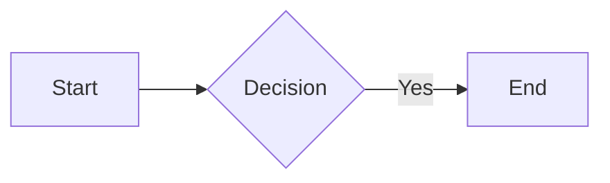

# md2visio 代码阅读完全指南

> 面向 C# 小白的循序渐进学习路线图

---

## 总览：学习路线图

```
第1周: 理解基础设施（3天）
  ├─ Day 1: 程序入口 - 理解程序如何启动
  ├─ Day 2: 核心数据结构 - 理解信息如何存储和传递
  └─ Day 3: 类型映射表 - 理解系统如何调度不同组件

第2周: 理解解析层（4天）
  ├─ Day 4: 状态机基础 - 理解状态机是什么
  ├─ Day 5: 解析上下文 - 理解文本如何被读取
  ├─ Day 6: 饼图解析器 - 最简单的完整示例
  └─ Day 7: 流程图解析器 - 复杂一点的例子

第3周: 理解数据层（3天）
  ├─ Day 8: Figure基类 - 理解数据结构基础
  ├─ Day 9: 饼图数据结构 - 最简单的数据模型
  └─ Day 10: 流程图数据结构 - 节点+边的图模型

第4周: 理解绘制层（4天）
  ├─ Day 11: VBuilder基类 - Visio应用管理
  ├─ Day 12: 饼图绘制器 - 最简单的绘制示例
  ├─ Day 13: 流程图绘制器 - 复杂绘制逻辑
  └─ Day 14: 配置系统 - YAML配置如何生效
```

---

## Day 1: 程序入口 - 理解程序如何启动

### 要看的文件
```
md2visio/main/AppConfig.cs
```

### 学习目标
理解程序启动时发生了什么

### 阅读指引

**第一步：看类的定义（第3-5行）**
```csharp
public class AppConfig : IDisposable
{
    public static AppConfig Instance { get; set; } = new AppConfig();
```

**小白解读**：
- `IDisposable` = 这个类需要手动清理资源（就像用完水要关水龙头）
- `static AppConfig Instance` = **单例模式**，整个程序只有一个 AppConfig 实例
- 这叫"全局配置管理器"，存放所有程序需要的设置

**第二步：看属性（第7-12行）**
```csharp
public string InputFile { get; set; } = string.Empty;   // 输入文件路径
public string OutputPath { get; set; } = string.Empty;  // 输出路径
public bool Visible { get; set; } = false;              // 是否显示Visio窗口
public bool Quiet { get; set; } = false;                // 是否静默覆盖
public bool Debug { get; set; } = false;                // 是否调试模式
```

**小白解读**：
- `{ get; set; }` = 自动属性，C#的语法糖，相当于自动创建了get/set方法
- `= string.Empty` = 默认值，初始化时的值

**第三步：看命令行参数解析（第22-57行）**
```csharp
public bool ParseArgs(string[] args)
{
    for (int i = 0; i < args.Length; i++)
    {
        string arg = args[i].ToUpper();

        if(arg=="/I" && i + 1 < args.Length)
        {
            InputFile = args[++i];  // /I 后面的参数是输入文件
        }
        // ...
    }
}
```

**小白解读**：
- `args` 是命令行传入的参数数组，比如 `md2visio.exe /I test.md /O out.vsdx`
- `args[++i]` = 先把 i 加 1，再取数组元素（获取 /I 后面的值）

**第四步：看主流程（第64-92行）**
```csharp
public void Main()
{
    // 步骤1: 创建解析上下文，读取输入文件
    var synContext = new SynContext(InputFile);

    // 步骤2: 启动状态机解析
    SttMermaidStart.Run(synContext);

    // 步骤3: 创建构建工厂，开始构建图表
    _factory = new FigureBuilderFactory(synContext.NewSttIterator());
    _factory.Build(OutputPath);

    // 步骤4: 清理
    if (!Visible) _factory.Quit();
}
```

**小白解读**：这就是整个程序的核心流程！
1. `SynContext` = 解析上下文，负责读文件和管理解析状态
2. `SttMermaidStart.Run()` = 启动状态机，开始解析 Mermaid 语法
3. `FigureBuilderFactory` = 构建工厂，把解析结果变成图表数据
4. `.Build()` = 执行构建和绘制

### 练习
1. 在代码中找到 `/V` 参数设置了哪个属性
2. 尝试理解 `IDisposable` 模式（第104-129行）是如何确保 Visio 被正确关闭的

---

## Day 2: 核心数据结构 - 信息如何存储和传递

### 要看的文件
```
md2visio/mermaid/@cmn/SynState.cs        (状态基类)
md2visio/mermaid/@cmn/SttIterator.cs     (状态迭代器)
```

### 学习目标
理解"状态"是什么，数据如何在系统中流动

### 阅读指引 - SynState.cs

**第一步：理解什么是"状态"（第7-18行）**
```csharp
internal abstract class SynState
{
    SynContext context = Empty.Get<SynContext>();  // 解析上下文的引用
    protected CompoDict compoList = new CompoDict(); // 存储解析出的组件

    public string Fragment { get { return compoList.Entire; } }  // 解析出的文本片段
```

**小白解读**：
- `abstract` = 抽象类，不能直接创建，必须由子类继承
- 每个"状态"代表解析过程中的**一个识别结果**
- `Fragment` = 这个状态识别出来的文本内容（如 "pie"、"Alice"、"->"）

**第二步：理解关键方法（第41-67行）**
```csharp
public SynState Take(int length = 1)  // 从输入中"吃掉"几个字符
{
    Ctx.Take(length);
    return this;
}

public SynState Slide(int length = 1)  // 滑动（消费但不缓存）
{
    Ctx.Slide(length);
    return this;
}
```

**小白解读**：
- `Take()` = 像吃饭一样，把字符"吃进"缓存
- `Slide()` = 像滑过去一样，消费字符但不保存
- `return this` = 返回自己，支持**链式调用**，如 `Take().Forward<NextState>()`

**第三步：理解状态转换（第82-108行）**
```csharp
public abstract SynState NextState();  // 子类必须实现：下一个状态是什么

public SynState Forward<T>() where T : SynState, new()  // 转发到下一个状态
{
    return Create<T>().NextState();  // 创建新状态并执行
}

public SynState Create<T>() where T : SynState, new()  // 创建新状态
{
    SynState clone = new T();  // 反射创建实例
    clone.Ctx = Ctx;           // 传递上下文
    return clone;
}
```

**小白解读**：
- `NextState()` = **抽象方法**，每个具体状态必须告诉系统"下一步干什么"
- `Forward<T>()` = **状态转移**，创建 T 类型的状态并执行它
- `where T : SynState, new()` = **泛型约束**，T 必须是 SynState 的子类，且有无参构造函数

### 阅读指引 - SttIterator.cs

**完整理解迭代器（第9-55行）**
```csharp
internal class SttIterator
{
    SynContext ctx;
    int stateIndex = -1;  // 当前位置（从-1开始，因为Next()会先++）

    public SynState Current { get { return ctx.StateList[stateIndex]; } }

    public bool HasNext() { return ctx.StateList.Count > stateIndex + 1; }

    public SynState Next() { return ctx.StateList[++stateIndex]; }
}
```

**小白解读**：
- 这是一个**遍历器**，用来依次读取所有解析出的状态
- `HasNext()` = 还有没有下一个
- `Next()` = 取下一个
- 就像数组的 for 循环，但封装得更优雅

### 练习
1. 在 `SynState.ToString()` 方法中找到状态如何被格式化输出
2. 思考：为什么 `stateIndex` 初始值是 -1 而不是 0？

---

## Day 3: 类型映射表 - 系统如何调度不同组件

### 要看的文件
```
md2visio/mermaid/@cmn/TypeMap.cs
md2visio/struc/figure/FigureBuilderFactory.cs（重点看 BuildFigure 方法）
```

### 学习目标
理解系统如何根据图表类型选择正确的解析器、构建器

### 阅读指引 - TypeMap.cs

**整个文件只有约60行，但它是系统的"中央路由器"！**

```csharp
public static readonly Dictionary<string, Type> KeywordMap = new()
{
    { "graph", typeof(GSttKeyword) },       // "graph" -> 用 GSttKeyword 解析
    { "flowchart", typeof(GSttKeyword) },   // "flowchart" -> 也用 GSttKeyword
    { "pie", typeof(PieSttKeyword) },       // "pie" -> 用 PieSttKeyword 解析
    { "sequenceDiagram", typeof(SeqSttKeyword) },
};
```

**小白解读**：
- `Dictionary<string, Type>` = 字符串到类型的映射
- `typeof(GSttKeyword)` = 获取 GSttKeyword 这个类的类型信息
- **作用**：当解析器看到 "pie" 关键字，就知道要用 `PieSttKeyword` 来处理

```csharp
public static readonly Dictionary<string, Type> BuilderMap = new()
{
    { "graph", typeof(GBuilder) },         // "graph" -> 用 GBuilder 构建
    { "pie", typeof(PieBuilder) },         // "pie" -> 用 PieBuilder 构建
};
```

**小白解读**：
- **作用**：当需要构建"pie"类型的图表，就创建 `PieBuilder` 实例

### 阅读指引 - FigureBuilderFactory.cs（关键代码）

**看 BuildFigure 方法（第98-196行）**
```csharp
void BuildFigure(string figureType)
{
    // 第1步：从映射表获取构建器类型
    Type type = builderDict[figureType];  // 比如 figureType="pie" -> type=PieBuilder

    // 第2步：反射创建构建器实例
    object? obj = Activator.CreateInstance(type, iter);  // 相当于 new PieBuilder(iter)

    // 第3步：反射获取 Build 方法
    MethodInfo? method = type.GetMethod("Build", ...);

    // 第4步：调用 Build 方法
    method?.Invoke(obj, new object[] { outputFilePath });  // 相当于 obj.Build(path)
}
```

**小白解读**：
- `Activator.CreateInstance()` = **反射创建对象**，运行时根据 Type 创建实例
- `method.Invoke()` = **反射调用方法**，运行时调用方法
- **为什么用反射**？因为不知道具体是哪个构建器，运行时才能确定！

### 设计模式解读

这里用到了**工厂模式 + 策略模式**：
```
                    +---------------------+
                    | FigureBuilderFactory| (工厂)
                    +----------+----------+
                               |
         +---------------------+---------------------+
         |                     |                     |
   +-----+----+         +------+-----+         +-----+----+
   | GBuilder |         |PieBuilder |         |JoBuilder | (策略)
   +----------+         +------------+         +----------+
```

- **工厂模式**：`FigureBuilderFactory` 负责创建正确的构建器
- **策略模式**：不同的 Builder 实现不同的构建策略

### 练习
1. 在 TypeMap 中找到时序图对应的构建器是哪个类
2. 思考：如果要添加新的图表类型，需要在 TypeMap 中添加几行代码？

---

## Day 4: 状态机基础 - 理解状态机是什么

### 要看的文件
```
md2visio/mermaid/@cmn/SttMermaidStart.cs (状态机入口)
```

### 学习目标
理解状态机如何工作

### 阅读指引

**完整的入口状态（只有24行！）**
```csharp
internal class SttMermaidStart : SynState
{
    public override SynState NextState()
    {
        return Run(Ctx);
    }

    public static SynState Run(SynContext ctx)
    {
        // 用正则表达式查找 "```mermaid"
        if (!ctx.Until(@"^\s*(?<bquote>`{3,})\s*mermaid\s*(?=\n)"))
            return EndOfFile;  // 没找到，返回文件结束

        // 找到了！创建状态并保存
        SynState state = new SttMermaidStart();
        state.Ctx = ctx;
        state.Fragment = ctx.ExpectedGroups["bquote"].Value;  // 保存 "```"
        ctx.AddState(state);  // 添加到状态列表

        return state.Forward<SttIntro>();  // 转到下一个状态
    }
}
```

**小白解读**：
- 状态机的工作方式：**当前状态 -> 识别模式 -> 保存结果 -> 转到下一个状态**
- `ctx.Until(正则)` = 在输入中查找匹配的模式
- `ctx.AddState(this)` = 把识别结果保存到状态列表
- `Forward<SttIntro>()` = 跳转到 SttIntro 状态继续处理

### 状态机可视化

```
输入文本: "```mermaid\npie\n  "Apple": 50\n```"

状态转换:
+---------------+   找到```mermaid   +-----------+   识别到pie   +--------------+
|SttMermaidStart| -----------------> | SttIntro  | ------------> | PieSttKeyword|
+---------------+                    +-----------+               +--------------+
                                                                        |
                                           +----------------------------+
                                           v
                                    +-------------+   识别到:   +-----------+
                                    |  PieSttChar | ----------> |PieSttTuple|
                                    +-------------+             +-----------+
```

### 练习
1. 找到 `SttIntro` 文件（在 `mermaid/@cmn/` 目录），看它是如何识别图表类型关键字的
2. 用调试模式运行程序 `/D`，观察输出的状态列表

---

## Day 5: 解析上下文 - 理解文本如何被读取

### 要看的文件
```
md2visio/mermaid/@cmn/SynContext.cs
```

### 学习目标
理解文本是如何被一个字符一个字符地处理的

### 阅读指引

**第一步：理解三个核心缓冲区（第9-13行）**
```csharp
List<SynState> stateList = new List<SynState>();  // 所有解析出的状态

StringBuilder incoming = new StringBuilder();  // 还没处理的文本（前面）
StringBuilder consumed = new StringBuilder();  // 已经处理的文本（后面）
StringBuilder cache = new StringBuilder();     // 当前正在识别的文本
```

**小白解读**（用吃面条比喻）：
- `incoming` = 碗里还没吃的面条
- `consumed` = 已经吃进肚子的面条
- `cache` = 正在嘴里嚼的面条

**第二步：理解文件读取（第27-39行）**
```csharp
public SynContext(string inputFile)
{
    string[] lines = File.ReadAllLines(inputFile, Encoding.UTF8);
    foreach (string line in lines)
        incoming.Append(line).Append('\n');  // 所有内容放入incoming
}
```

**第三步：理解 Peek/Take/Slide（第41-71行）**
```csharp
public string? Peek(int length = 1)  // 偷看前面的字符（不消费）
{
    if (length >= 0) return incoming.ToString(0, length);
}

public string? Take(int length = 1)  // 取走字符（存入cache）
{
    string take = incoming.ToString(0, length);
    consumed.Append(take);
    cache.Append(take);  // 存入缓存！
    Skip(length);        // 从incoming移除
    return take;
}

public string? Slide(int length = 1)  // 滑过字符（不存入cache）
{
    string slide = incoming.ToString(0, length);
    consumed.Append(slide);
    Skip(length);        // 不存入缓存！
    return slide;
}
```

**小白解读**：
```
初始状态:
  incoming: "pie\n  "Apple": 50"
  consumed: ""
  cache:    ""

执行 Take(3) 后:
  incoming: "\n  "Apple": 50"
  consumed: "pie"
  cache:    "pie"     <- 保存了！用于后续识别

执行 Slide(1) 后（跳过换行符）:
  incoming: "  "Apple": 50"
  consumed: "pie\n"
  cache:    "pie"     <- 没变！换行符被跳过
```

**第四步：理解正则匹配（第106-131行）**
```csharp
public bool Expect(string pattern)  // 期望匹配某个模式
{
    Match match = Regex.Match(incoming.ToString(), $"^(?<tail>{pattern})");
    if (match.Success)
    {
        consumed.Append(match.Groups[0].Value);
        incoming.Remove(0, match.Length);
        return true;
    }
    return false;
}
```

**小白解读**：
- `^` = 从头开始匹配
- `(?<tail>...)` = 命名捕获组，匹配的内容可以通过 `ExpectedGroups["tail"]` 获取

### 练习
1. 画出执行 `ctx.Until(@"pie")` 后三个缓冲区的状态变化
2. 思考：为什么要区分 `Take()` 和 `Slide()`？

---

## Day 6: 饼图解析器 - 最简单的完整示例

### 要看的文件（按顺序看！）
```
1. md2visio/mermaid/pie/PieSttKeyword.cs  (识别关键字)
2. md2visio/mermaid/pie/PieSttChar.cs     (字符分发器)
3. md2visio/mermaid/pie/PieSttTuple.cs    (识别数据项)
4. md2visio/mermaid/pie/PieSttWord.cs     (识别单词)
```

### 学习目标
完整理解一个图表类型的解析流程

### 阅读指引

**文件1: PieSttKeyword.cs - 关键字识别**
```csharp
internal class PieSttKeyword : SynState
{
    public override SynState NextState()
    {
        // 检查缓存中的内容是否是饼图关键字
        if (!IsKeyword(Ctx)) throw new SynException($"unknown keyword", Ctx);

        Save(Buffer).ClearBuffer();  // 保存状态，清空缓存

        if (PieSttKeywordParam.HasParam(Ctx))
            return Forward<PieSttKeywordParam>();  // 有参数，处理参数
        else
            return Forward<PieSttChar>();  // 没参数，继续处理字符
    }

    public static bool IsKeyword(SynContext ctx)
    {
        return Regex.IsMatch(ctx.Cache.ToString(), "^(pie|title)$");  // pie或title
    }
}
```

**小白解读**：
- `Save(Buffer)` = 把当前缓存内容（如"pie"）保存为这个状态的 Fragment
- `ClearBuffer()` = 清空缓存，准备识别下一个东西
- **饼图只有两个关键字**：`pie`（图表声明）和 `title`（标题）

**文件2: PieSttChar.cs - 字符分发器（核心！）**
```csharp
internal class PieSttChar : SynState
{
    public override SynState NextState()
    {
        string? next = Ctx.Peek();  // 偷看下一个字符
        if (next == null) return EndOfFile;

        if (next == "%")  return Forward<SttPercent>();     // 注释
        if (next == ":")  return Forward<PieSttTuple>();    // 数据项 "Label": 50
        if (next == " ")  return Forward<PieSttWord>();     // 空格后是单词
        if (next == "\n") return Forward<SttFinishFlag>(); // 换行=语句结束
        if (next == "`")  return Forward<SttMermaidClose>(); // ```=代码块结束

        return Take().Forward<PieSttChar>();  // 普通字符，吃掉，继续
    }
}
```

**小白解读**：
- **这是一个"分发器"**！根据下一个字符决定去哪个状态
- `Take().Forward<PieSttChar>()` = 吃掉当前字符，再回到 PieSttChar 继续看下一个
- 这是个**循环**！一直在 PieSttChar 转，直到遇到特殊字符

**状态转换图**：
```
                    +----------------------------------+
                    |           PieSttChar             |
                    |  （根据下一个字符决定去向）         |
                    +----------------------------------+
                           |     |     |     |
          +----------------+-----+-----+-----+----------------+
          v                v           v           v          v
     遇到 ":"         遇到空格      遇到换行     遇到 %      遇到普通字符
          v                v           v           v          v
    +----------+    +----------+ +----------+ +----------+ +----------+
    |PieSttTuple|   |PieSttWord| |SttFinish | |SttPercent| |Take()再循环|
    |(数据项)   |   |(单词)    | |(结束标记)| |(注释)    | |          |
    +----------+    +----------+ +----------+ +----------+ +----------+
```

### 模拟解析过程

输入：
```
pie
  "Apple": 50
  "Banana": 30
```

解析过程：
```
1. SttMermaidStart 找到 ```mermaid
2. SttIntro 识别到 "pie" 关键字
3. PieSttKeyword 保存 "pie"
4. PieSttChar 遇到换行 -> SttFinishFlag
5. PieSttChar 遇到空格 -> PieSttWord
6. PieSttWord 识别 "Apple"
7. PieSttChar 遇到 : -> PieSttTuple 保存 ("Apple", 50)
8. ... 继续处理 Banana ...

最终 StateList:
  [0] SttMermaidStart  @ "```"
  [1] PieSttKeyword    @ "pie"
  [2] ■ (结束标记)
  [3] PieSttTuple      @ ""Apple": 50"
  [4] ■
  [5] PieSttTuple      @ ""Banana": 30"
  [6] ■
  [7] SttMermaidClose  @ "```"
```

### 练习
1. 打开 `PieSttTuple.cs`，看它如何解析 `"Label": 50` 格式
2. 创建一个测试文件 `test-pie.md`，用 `/D` 参数运行，观察状态列表

---

## Day 7: 流程图解析器 - 复杂一点的例子

### 要看的文件
```
md2visio/mermaid/graph/GSttKeyword.cs    (关键字：graph/flowchart/subgraph)
md2visio/mermaid/graph/GSttChar.cs       (字符分发器)
md2visio/mermaid/graph/GSttText.cs       (节点文本)
md2visio/mermaid/graph/GSttLinkStart.cs  (连线开始)
md2visio/mermaid/graph/GSttLinkEnd.cs    (连线结束)
```

### 学习目标
理解更复杂的解析逻辑

### 关键概念

**流程图语法示例**：


**需要识别的元素**：
- `graph LR` = 图表声明 + 方向
- `A` = 节点ID
- `[Start]` = 节点文本（方括号）
- `-->` = 箭头类型
- `|Yes|` = 连线标签

**比饼图复杂的地方**：
1. 节点形状多样：`[]` `{}` `()` `(())` `[[]]` 等
2. 连线类型多样：`-->` `---` `-.->` `==>` 等
3. 支持子图：`subgraph` ... `end`

### 练习
1. 在 `GSttText.cs` 中找到如何识别不同形状的节点
2. 在 `GSttLinkStart.cs` 中找到如何识别不同类型的箭头

---

## Day 8: Figure基类 - 理解数据结构基础

### 要看的文件
```
md2visio/struc/figure/Figure.cs
md2visio/struc/figure/FigureBuilder.cs
md2visio/struc/figure/Container.cs
```

### 学习目标
理解图表数据是如何组织的

### 阅读指引 - Figure.cs

```csharp
internal abstract class Figure : Container
{
    string title = string.Empty;
    Config config;

    public string Title { get => title; set => title = value.Trim(); }
    public Config Config { get => config; }

    public abstract void ToVisio(string path);  // 子类实现：如何画成Visio
}
```

**小白解读**：
- `Figure` 是所有图表的**基类**
- 继承自 `Container`，说明图表是一种容器（可以包含节点）
- `ToVisio()` 是抽象方法，每种图表自己决定怎么画

### 阅读指引 - FigureBuilder.cs

```csharp
internal abstract class FigureBuilder
{
    protected SttIterator iter;  // 状态迭代器

    public FigureBuilder(SttIterator iter)
    {
        this.iter = iter;
    }

    abstract public void Build(string outputFile);  // 子类实现：如何构建
}
```

**小白解读**：
- 每个构建器接收一个 `SttIterator`（状态迭代器）
- 遍历状态列表，根据不同状态类型构建数据结构

---

## Day 9: 饼图数据结构 - 最简单的数据模型

### 要看的文件
```
md2visio/struc/pie/Pie.cs           (饼图容器)
md2visio/struc/pie/PieBuilder.cs    (饼图构建器)
md2visio/struc/pie/PieDataItem.cs   (数据项)
```

### 阅读指引 - PieBuilder.cs

```csharp
internal class PieBuilder(SttIterator iter) : FigureBuilder(iter)
{
    readonly Pie pie = new();  // 创建空饼图

    public override void Build(string outputFile)
    {
        while (iter.HasNext())  // 遍历所有状态
        {
            SynState cur = iter.Next();

            if (cur is PieSttKeyword) { BuildKeyword(); }   // 关键字
            if (cur is PieSttTuple) { BuildDataItem(); }    // 数据项
            if (cur is SttMermaidClose)  // 代码块结束
            {
                pie.ToVisio(outputFile);  // 画图！
                break;
            }
        }
    }

    void BuildDataItem()
    {
        PieSttTuple tuple = (PieSttTuple) iter.Current;

        // 从状态中提取数据
        string label = tuple.CompoList.Get(1);  // "Apple"
        double data = double.Parse(tuple.CompoList.Get(2));  // 50

        PieDataItem dataItem = new PieDataItem { Label = label, Data = data };
        pie.AddInnerNode(dataItem);  // 添加到饼图
    }
}
```

**小白解读**：
- 构建器就是一个**状态消费者**
- 遍历 StateList，根据状态类型调用不同的处理方法
- 最终构建出完整的 `Pie` 对象

---

## Day 10: 流程图数据结构 - 节点+边的图模型

### 要看的文件
```
md2visio/struc/graph/Graph.cs       (流程图)
md2visio/struc/graph/GBuilder.cs    (构建器)
md2visio/struc/graph/GNode.cs       (节点)
md2visio/struc/graph/GEdge.cs       (边/连线)
md2visio/struc/graph/GSubgraph.cs   (子图)
```

### 学习目标
理解图论数据结构：节点(Node)和边(Edge)

---

## Day 11: VBuilder基类 - Visio应用管理

### 要看的文件
```
md2visio/vsdx/@base/VBuilder.cs          (Visio应用管理)
md2visio/vsdx/@base/VFigureBuilder.cs    (图表构建器基类)
md2visio/vsdx/@base/VFigureDrawer.cs     (图表绘制器基类)
```

### 阅读指引 - VBuilder.cs

```csharp
internal abstract class VBuilder
{
    public static Visio.Application? VisioApp = null;  // 静态共享！
    protected Visio.Document visioDoc;
    protected Visio.Page visioPage;

    public VBuilder()
    {
        EnsureVisioApp();  // 确保Visio可用
        visioDoc = VisioApp!.Documents.Add("");  // 新建文档
        visioPage = visioDoc.Pages[1];  // 获取第一页
    }
```

**小白解读**：
- `static Visio.Application` = **全局共享的Visio实例**
- 为什么共享？因为启动Visio很慢，多个图表可以复用同一个实例
- `EnsureVisioApp()` = 智能检测：如果Visio可用就复用，否则重新创建

### COM对象管理重点

```csharp
private static void EnsureVisioApp()
{
    try
    {
        if (VisioApp != null)
        {
            _ = VisioApp.Version;  // 测试COM对象是否有效
            return;
        }
    }
    catch (COMException)
    {
        VisioApp = null;  // 失效了，清空
    }

    VisioApp = new Visio.Application();  // 创建新的
}
```

**小白解读**：
- COM 对象可能被外部关闭（用户手动关Visio）
- 通过访问 `.Version` 测试对象是否还有效
- 无效就重建，这是一种**防御性编程**

---

## Day 12: 饼图绘制器 - 最简单的绘制示例

### 要看的文件
```
md2visio/vsdx/VBuilderPie.cs   (构建器)
md2visio/vsdx/VDrawerPie.cs    (绘制器)
```

### 阅读指引 - VBuilderPie.cs

```csharp
internal class VBuilderPie(Pie figure) : VFigureBuilder<Pie>(figure)
{
    protected override void ExecuteBuild()
    {
        new VDrawerPie(figure, VisioApp).Draw();  // 委托给绘制器
    }
}
```

**小白解读**：
- 构建器很简单：创建绘制器，调用 Draw()
- 真正的绘制逻辑在 `VDrawerPie` 中

### 练习
打开 `VDrawerPie.cs`，找到：
1. 如何计算每个扇形的角度
2. 如何调用 Visio API 画扇形

---

## Day 13: 流程图绘制器 - 复杂绘制逻辑

### 要看的文件
```
md2visio/vsdx/VBuilderG.cs     (流程图构建器)
md2visio/vsdx/VDrawerG.cs      (流程图绘制器)
md2visio/vsdx/@tool/           (绘制工具集)
```

### 学习目标
理解复杂图表的绘制流程：布局计算、形状绘制、连线绘制

---

## Day 14: 配置系统 - YAML配置如何生效

### 要看的文件
```
md2visio/struc/figure/Config.cs
md2visio/default/*.yaml         (所有配置文件)
```

### 学习目标
理解配置是如何加载和应用的

---

## 总结：代码文件阅读清单

| 天数 | 主题 | 文件 | 难度 |
|------|------|------|------|
| 1 | 程序入口 | `main/AppConfig.cs` | * |
| 2 | 状态基类 | `mermaid/@cmn/SynState.cs`, `SttIterator.cs` | ** |
| 3 | 类型映射 | `mermaid/@cmn/TypeMap.cs`, `FigureBuilderFactory.cs` | ** |
| 4 | 状态机入口 | `mermaid/@cmn/SttMermaidStart.cs` | * |
| 5 | 解析上下文 | `mermaid/@cmn/SynContext.cs` | *** |
| 6 | 饼图解析 | `mermaid/pie/*.cs` | ** |
| 7 | 流程图解析 | `mermaid/graph/*.cs` | *** |
| 8 | Figure基类 | `struc/figure/Figure.cs`, `FigureBuilder.cs` | ** |
| 9 | 饼图数据 | `struc/pie/*.cs` | ** |
| 10 | 流程图数据 | `struc/graph/*.cs` | *** |
| 11 | Visio管理 | `vsdx/@base/*.cs` | *** |
| 12 | 饼图绘制 | `vsdx/VBuilderPie.cs`, `VDrawerPie.cs` | ** |
| 13 | 流程图绘制 | `vsdx/VBuilderG.cs`, `VDrawerG.cs` | **** |
| 14 | 配置系统 | `struc/figure/Config.cs`, `default/*.yaml` | ** |

---

## 建议的学习方法

1. **边看边跑**：每看完一个文件，用调试模式 `/D` 运行，观察输出
2. **画图理解**：画出状态转换图，画出类继承关系图
3. **加日志**：在关键位置加 `Console.WriteLine()`，观察执行流程
4. **小改动实验**：尝试修改一个小功能，看效果

---

*本文档生成时间：2025-12-23*
