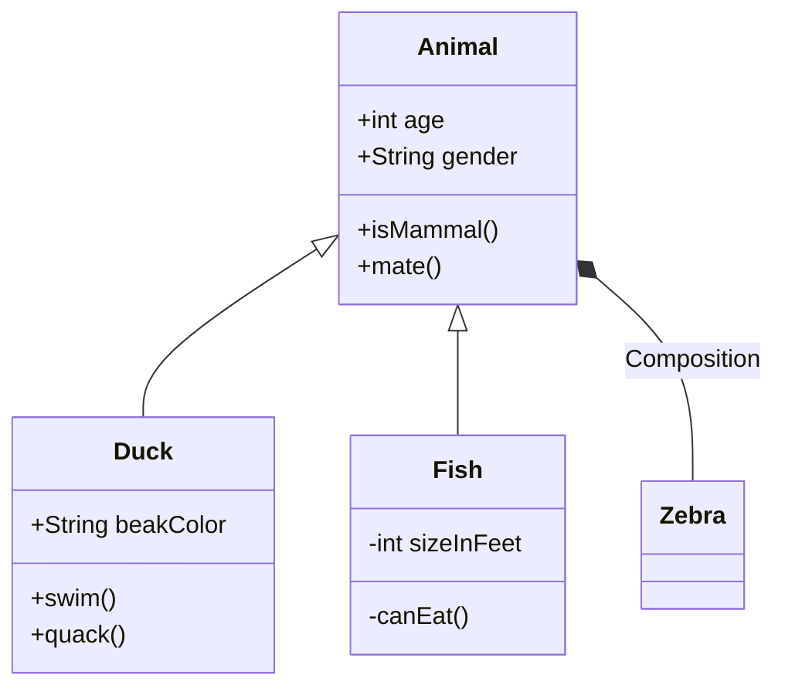

```mermaid
classDiagram
    class Animal {
        +int age
        +String gender
        +isMammal()
        +mate()
    }
    class Duck {
        +String beakColor
        +swim()
        +quack()
    }
    class Fish {
        -int sizeInFeet
        -canEat()
    }

    Animal <|-- Duck
    Animal <|-- Fish
    Animal *-- Zebra : Composition
```
