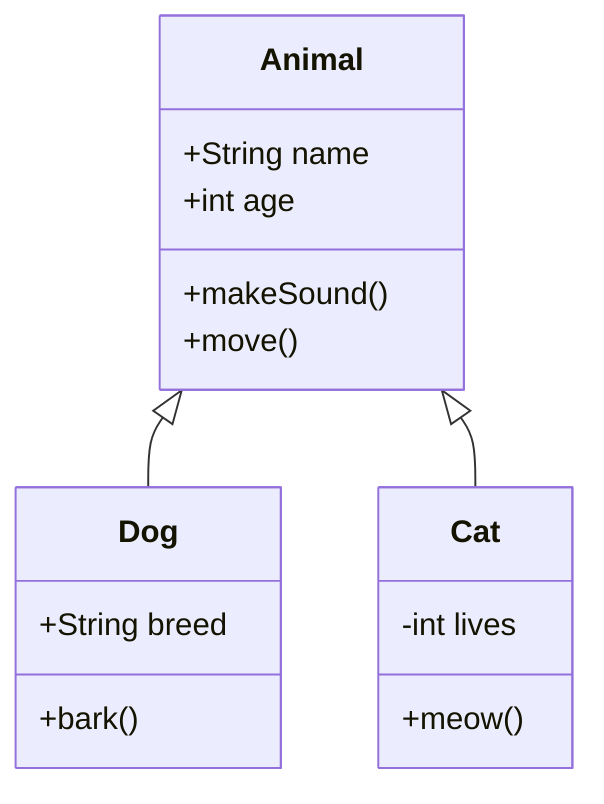
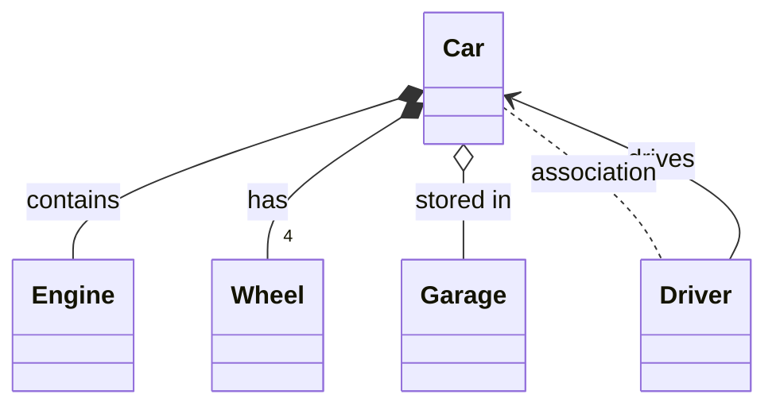
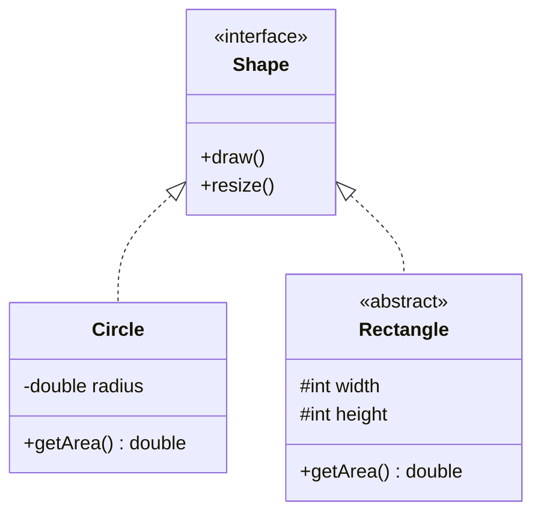
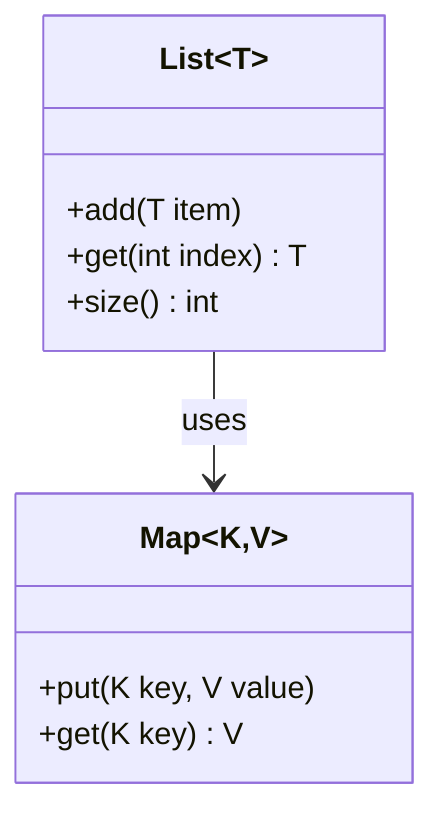
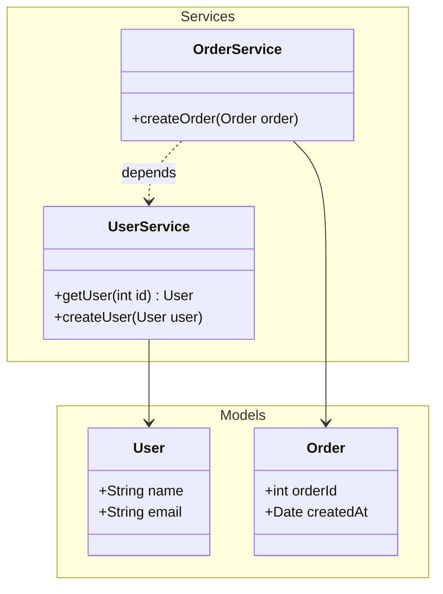
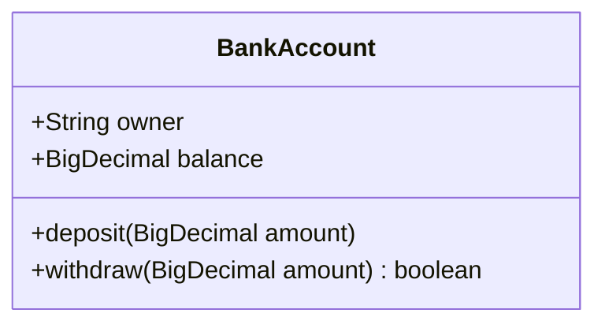
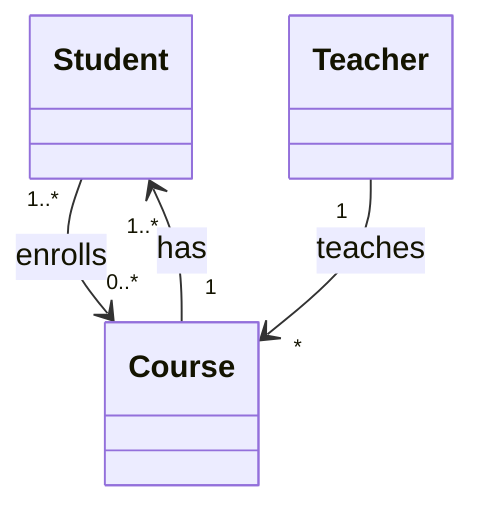
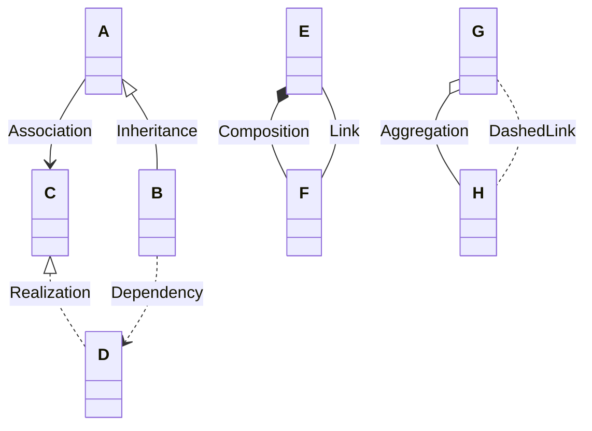

# Class Diagram Basic

```mermaid
classDiagram
    class Animal {
        +String name
        +int age
        +makeSound()
        +move()
    }
    class Dog {
        +String breed
        +bark()
    }
    class Cat {
        -int lives
        +meow()
    }
    Animal <|-- Dog
    Animal <|-- Cat
```

# Relationships

```mermaid
classDiagram
    class Car
    class Engine
    class Wheel
    class Driver
    class Garage

    Car *-- Engine : contains
    Car *-- "4" Wheel : has
    Driver --> Car : drives
    Car o-- Garage : stored in
    Car .. Driver : association
```

# Visibility and Annotations

```mermaid
classDiagram
    class Shape {
        <<interface>>
        +draw()
        +resize()
    }
    class Circle {
        -double radius
        +getArea() double
    }
    class Rectangle {
        <<abstract>>
        #int width
        #int height
        +getArea() double
    }

    Shape <|.. Circle
    Shape <|.. Rectangle
```

# Generics

```mermaid
classDiagram
    class List~T~ {
        +add(T item)
        +get(int index) T
        +size() int
    }
    class Map~K,V~ {
        +put(K key, V value)
        +get(K key) V
    }

    List~T~ --> Map~K,V~ : uses
```

# Namespace

```mermaid
classDiagram
    namespace Models {
        class User {
            +String name
            +String email
        }
        class Order {
            +int orderId
            +Date createdAt
        }
    }

    namespace Services {
        class UserService {
            +getUser(int id) User
            +createUser(User user)
        }
        class OrderService {
            +createOrder(Order order)
        }
    }

    UserService --> User
    OrderService --> Order
    OrderService ..> UserService : depends
```

# Inline Member Definition

```mermaid
classDiagram
    class BankAccount
    BankAccount : +String owner
    BankAccount : +BigDecimal balance
    BankAccount : +deposit(BigDecimal amount)
    BankAccount : +withdraw(BigDecimal amount) boolean
```

# Cardinality

```mermaid
classDiagram
    class Student
    class Course
    class Teacher

    Student "1..*" --> "0..*" Course : enrolls
    Teacher "1" --> "*" Course : teaches
    Course "1" --> "1..*" Student : has
```

# All Relation Types

```mermaid
classDiagram
    class A
    class B
    class C
    class D
    class E
    class F
    class G
    class H

    A <|-- B : Inheritance
    C <|.. D : Realization
    E *-- F : Composition
    G o-- H : Aggregation
    A --> C : Association
    B ..> D : Dependency
    E -- F : Link
    G .. H : DashedLink
```
