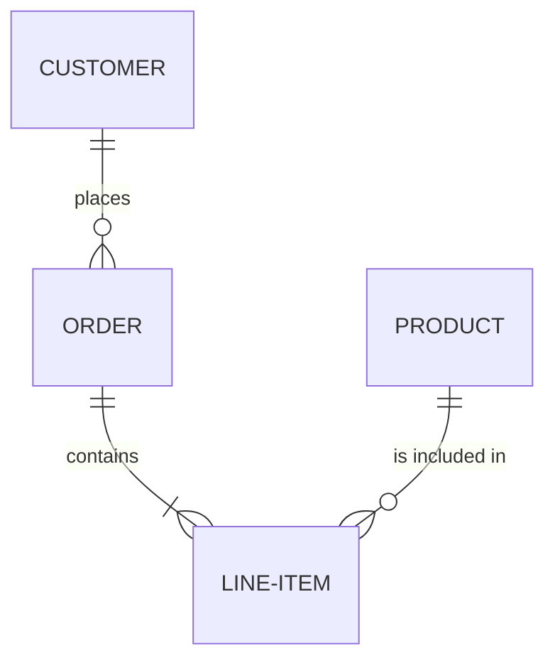
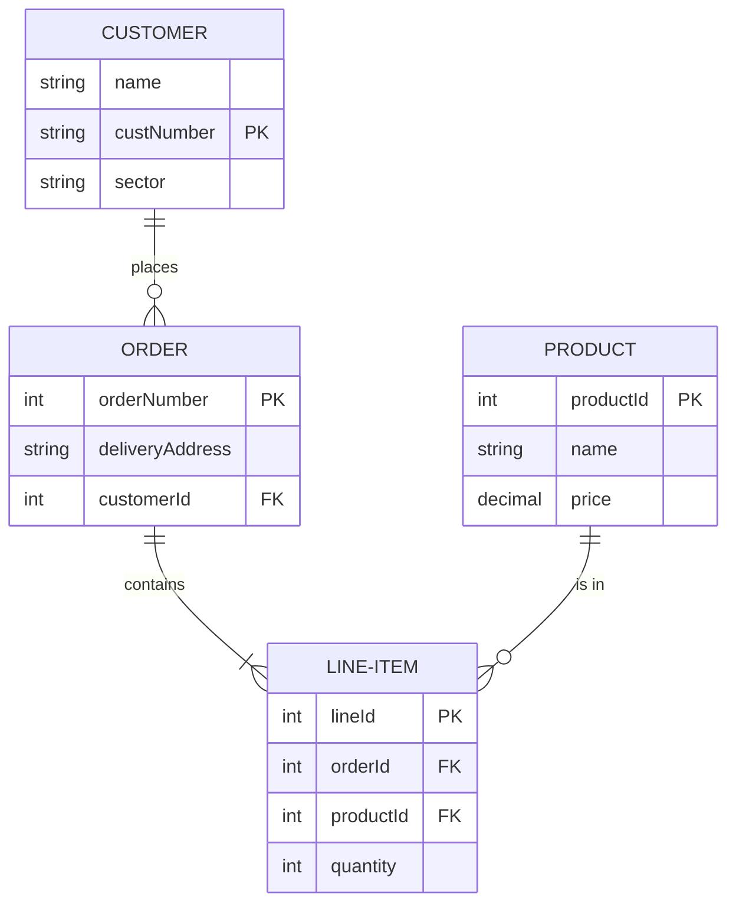
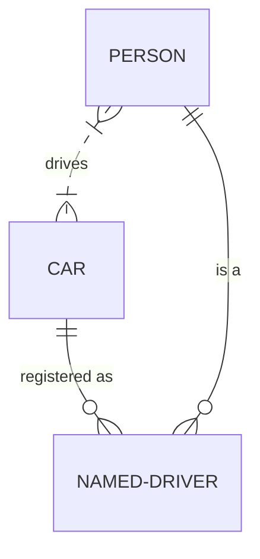
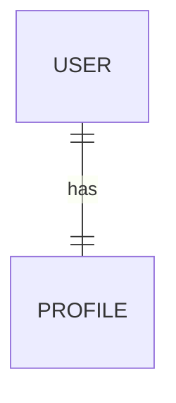

# ER Diagram Test

## Basic Relationships

```mermaid
erDiagram
    CUSTOMER ||--o{ ORDER : places
    ORDER ||--|{ LINE-ITEM : contains
    PRODUCT ||--o{ LINE-ITEM : "is included in"
```

## Entities with Attributes

```mermaid
erDiagram
    CUSTOMER {
        string name
        string custNumber PK
        string sector
    }
    ORDER {
        int orderNumber PK
        string deliveryAddress
        int customerId FK
    }
    LINE-ITEM {
        int lineId PK
        int orderId FK
        int productId FK
        int quantity
    }
    PRODUCT {
        int productId PK
        string name
        decimal price
    }
    CUSTOMER ||--o{ ORDER : places
    ORDER ||--|{ LINE-ITEM : contains
    PRODUCT ||--o{ LINE-ITEM : "is in"
```

## Non-Identifying Relationships (Dashed Lines)

```mermaid
erDiagram
    PERSON }|..|{ CAR : drives
    CAR ||--o{ NAMED-DRIVER : "registered as"
    PERSON ||--o{ NAMED-DRIVER : "is a"
```

## Simple Entity Only

```mermaid
erDiagram
    USER
    PROFILE
    USER ||--|| PROFILE : has
```
