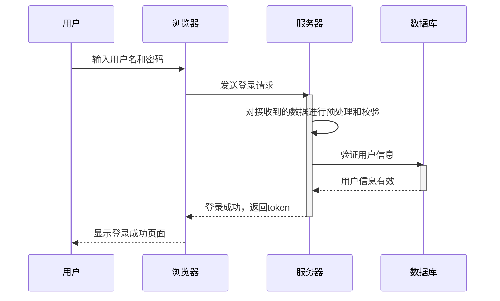
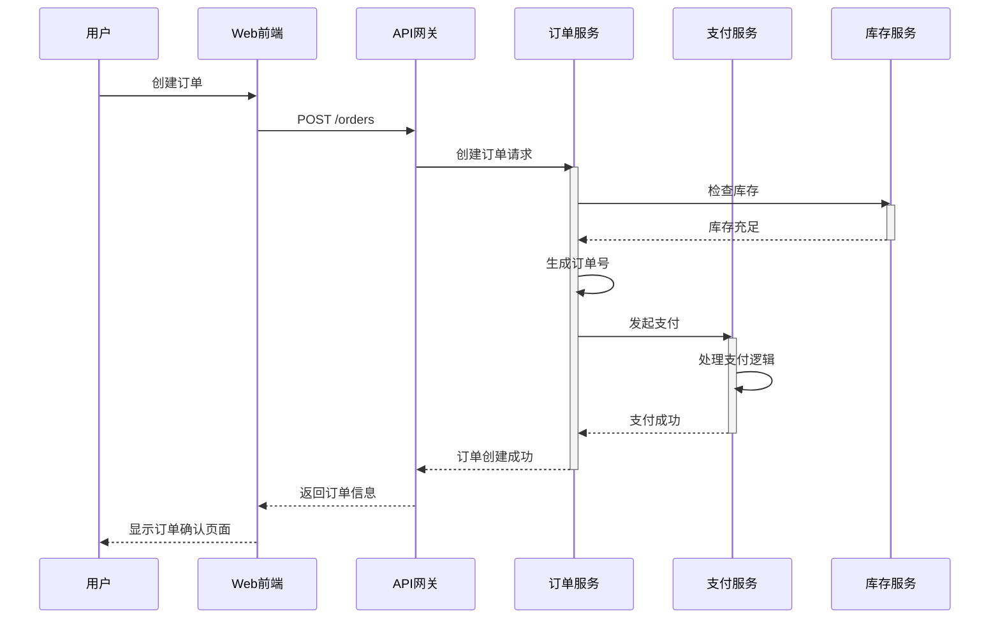
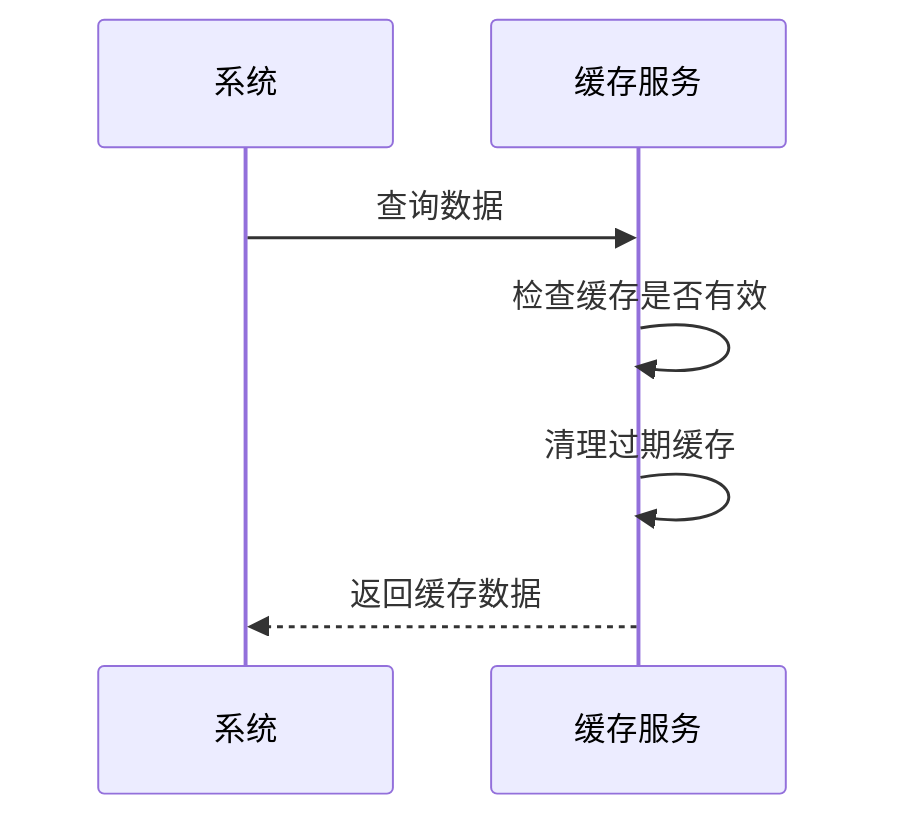
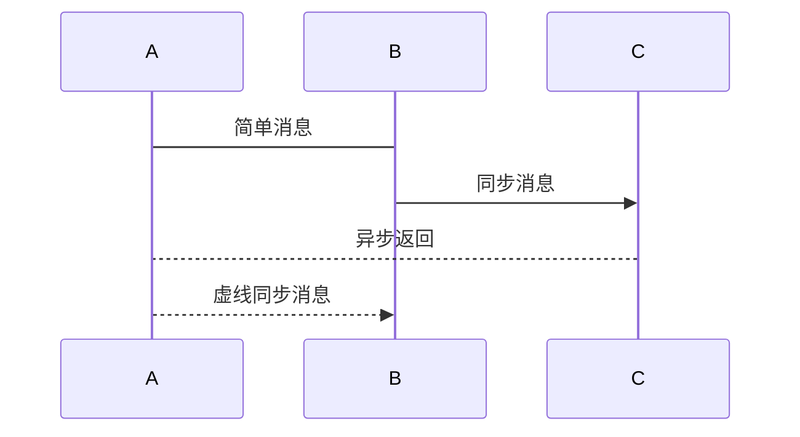

# 时序图测试

## 基础时序图 - 用户登录流程

```mermaid
sequenceDiagram
    participant a as 用户
    participant b as 浏览器
    participant c as 服务器
    participant d as 数据库

    a->>b: 输入用户名和密码
    b->>c: 发送登录请求
    activate c
    c->>c: 对接收到的数据进行预处理和校验
    c->>d: 验证用户信息
    activate d
    d-->>c: 用户信息有效
    deactivate d
    c-->>b: 登录成功，返回token
    deactivate c
    b-->>a: 显示登录成功页面
```

## 复杂时序图 - 订单处理流程

```mermaid
sequenceDiagram
    participant user as 用户
    participant web as Web前端
    participant api as API网关
    participant order as 订单服务
    participant payment as 支付服务
    participant inventory as 库存服务

    user->>web: 创建订单
    web->>api: POST /orders
    api->>order: 创建订单请求
    
    activate order
    order->>inventory: 检查库存
    activate inventory
    inventory-->>order: 库存充足
    deactivate inventory
    
    order->>order: 生成订单号
    order->>payment: 发起支付
    
    activate payment
    payment->>payment: 处理支付逻辑
    payment-->>order: 支付成功
    deactivate payment
    
    order-->>api: 订单创建成功
    deactivate order
    api-->>web: 返回订单信息
    web-->>user: 显示订单确认页面
```

## 自调用测试

```mermaid
sequenceDiagram
    participant sys as 系统
    participant cache as 缓存服务

    sys->>cache: 查询数据
    cache->>cache: 检查缓存是否有效
    cache->>cache: 清理过期缓存
    cache-->>sys: 返回缓存数据
```

## 简单消息类型测试

```mermaid
sequenceDiagram
    participant A
    participant B
    participant C

    A->B: 简单消息
    B->>C: 同步消息
    C-->A: 异步返回
    A-->>B: 虚线同步消息
```