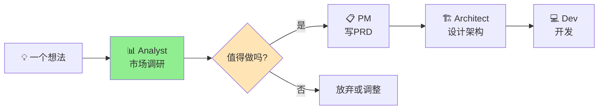

```mermaid
graph LR
    A[💡 一个想法] --> B[📊 Analyst<br/>市场调研]
    B --> C{值得做吗?}
    C -->|是| D[📋 PM<br/>写PRD]
    C -->|否| E[放弃或调整]
    D --> F[🏗️ Architect<br/>设计架构]
    F --> G[💻 Dev<br/>开发]

    style B fill:#90EE90
    style C fill:#FFE4B5
```